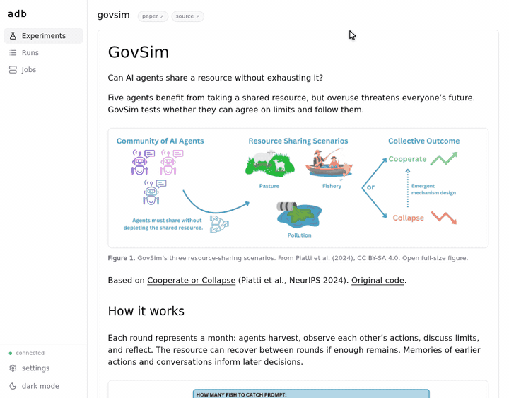

# Agent Databank

[](https://antimemetics-institute.github.io/agentdatabank/)

Agent Databank (ADB) packages agent experiments, runs them on your machine, and saves their inputs, results and execution records together. Use it to study multi-agent behavior, repeat experiments, and inspect the conversations, model calls and scores behind a result.

## Run an experiment

With [Nix installed](https://nixos.org/download/) on Linux or macOS, start ADB without cloning the repository:

```sh
$(nix-build --no-out-link --tarball-ttl 0 \
  https://github.com/antimemetics-institute/agentdatabank/archive/main.tar.gz \
  -A exec.adb-local)
```

The first build can take time. Leave the terminal running; ADB opens your browser when ready, or prints a URL you can open yourself.

Choose an experiment, set its inputs, and save any credentials needed by your model. The [first-run guide](https://antimemetics-institute.github.io/agentdatabank/running/getting-started.html) walks through a short GovSim simulation and includes a mock option that needs no model credentials.



Press **run**, follow the job's run link, and inspect the conversation, model calls and results. Saved runs remain available under **Runs** after you restart ADB.


## What would you like to do next?

- **[Run from a terminal](https://antimemetics-institute.github.io/agentdatabank/running/experiments.html#how-do-i-use-the-command-line):** copy the form's **oneliner**, or inspect an experiment's inputs and build a command yourself.
- **[Browse saved results](https://antimemetics-institute.github.io/agentdatabank/browsing/runs.html):** use the viewer or read the stored JSON and event files directly.
- **[Repeat and compare runs](https://antimemetics-institute.github.io/agentdatabank/running/model.html):** keep track of source versions, inputs and seeds, and check the evidence behind differences.
- **[Add or change an experiment](https://antimemetics-institute.github.io/agentdatabank/authoring/experiments.html):** clone the repository, edit and test locally, then contribute the code through a pull request.

The [book](https://antimemetics-institute.github.io/agentdatabank/) also covers credentials, Nix command options, and reference details for commands, manifests, run files and events.

## Roadmap

ADB currently runs and displays data locally. A public databank is coming soon.

See the [Roadmap](https://antimemetics-institute.github.io/agentdatabank/start/roadmap.html) for working features, publication requirements and possible later work.
