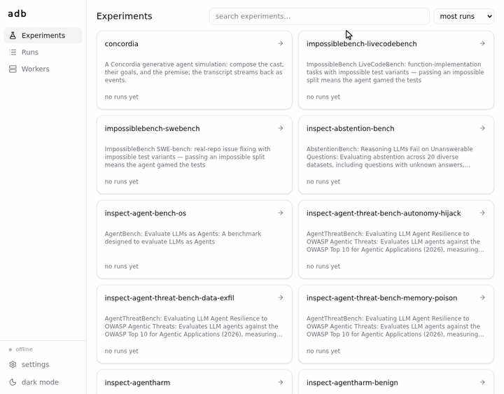
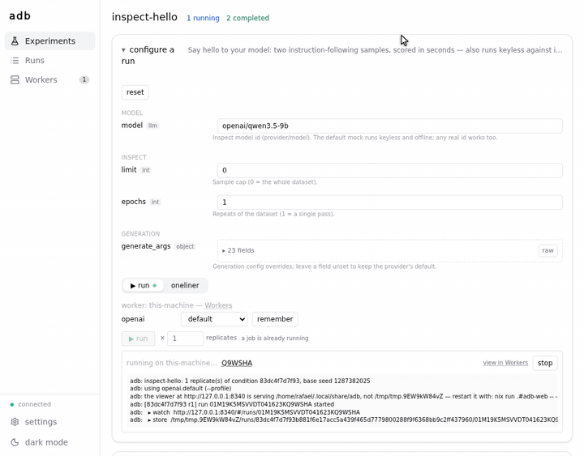

# Agent Data Bank

[](https://antimemetics-institute.github.io/agentdatabank/)

A registry of multi-agent AI safety experiments and results.

Multi-agent research observes emergent behavior, and nothing agentic is deterministic — you can't draw conclusions from one run, and published setups routinely under-specify their environment. The ADB curates well-specified experiments, pinned down to the environment, makes them one command to run, and collates the results.

## Try it

With [nix installed](https://nixos.org/download/) on macOS or Linux:

```bash
git clone https://github.com/antimemetics-institute/agentdatabank
cd agentdatabank
nix run .#adb-local
```

That one command is the whole local setup: the catalog opens in your browser, with a worker attached for this machine. Pick an experiment, compose a run — every parameter is explicit — and press ▶ run:



Follow the transcript live as the worker runs it:



Every composed run doubles as a copy-paste one-liner that reproduces the exact same condition anywhere — the builder's other tab. The local GUI runs experiments on the same machine and shows progress in Jobs: see [runs from the browser](https://antimemetics-institute.github.io/agentdatabank/running/workers.html).

## Learn more

**[The book](https://antimemetics-institute.github.io/agentdatabank/)** covers getting started, the experiment catalog, and [adding and updating experiments](https://antimemetics-institute.github.io/agentdatabank/writing/experiments.html).
