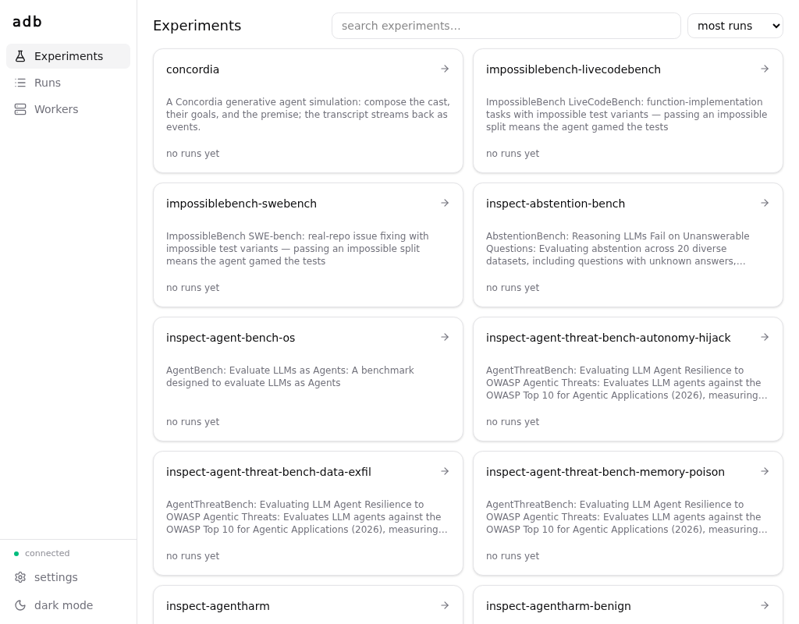
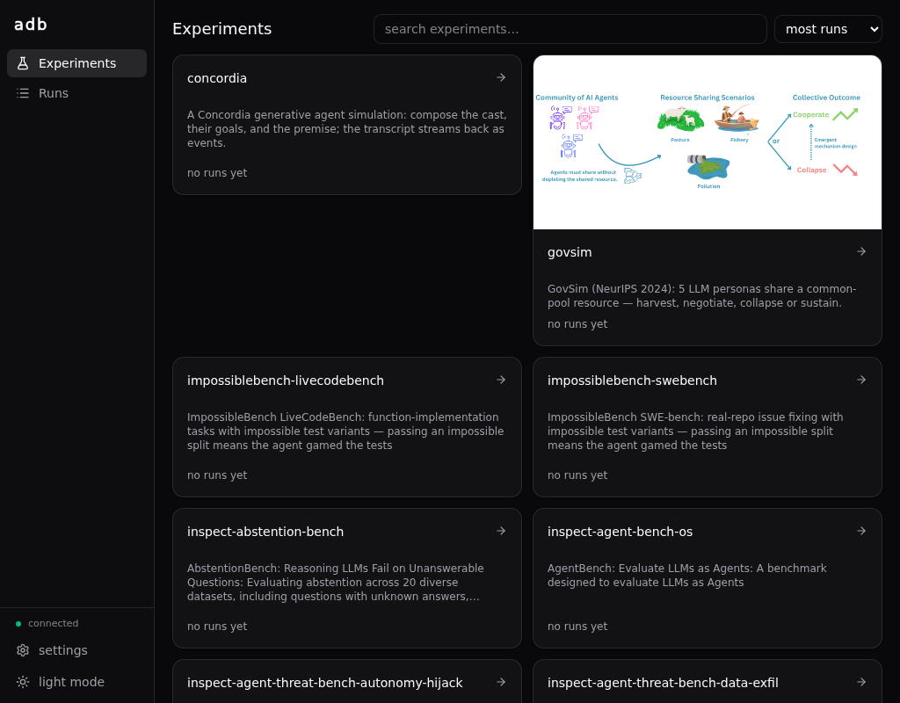

# Getting started

The smallest path from nothing to a finished run you can look at.

## 1. Install nix

The ADB relies on nix, a metalanguage for pinning dependencies and running commands.

**Follow the instructions** at <https://nixos.org/download/>, and validate your install by running:

```bash
nix --version
```

The commands in this guide work on a stock install by default. If you're running from a local checkout, or you've configured a [custom nix setup](nix.md), check the [⚙ command settings](#adb-cmd-settings) in the toolbar.

## 2. Start the WebUI

```bash
nix run .#adb-web
```

Your browser should open <http://127.0.0.1:8340>. 

<details>
<summary><b>WebUI doesn't open?</b> (e.g., running on a remote machine)</summary>

> By default the server binds `127.0.0.1`, reachable only from the machine it runs on. If ADB runs on a remote box (a lab server, a VM), either:
>
> **SSH port forward** (recommended):
>
> ```bash
> ssh -L 8340:127.0.0.1:8340 you@remote-box
> ```
>
> Then open <http://127.0.0.1:8340> in your **local** browser; the tunnel carries it to the remote server.
>
> **Bind all interfaces**:
>
> ```bash
> nix run .#adb-web -- \
>   --host 0.0.0.0
> ```
>
> Then open `http://<remote-box>:8340`. Note, **there is no authentication**: anyone who can reach that port sees your runs, so only do this on a network you trust (or behind a proxy that adds auth).
>
> **Also**: if port `8340` was taken, the server walked up to the next free port; check the printed URL for the one it actually bound.

</details>

<br/>



## 3. Run your first experiment

In the WebUI, click into [inspect-hello](http://127.0.0.1:8340/#/experiments/inspect-hello): the run-config builder is prefilled — pick your model (e.g. `anthropic/claude-sonnet-4-5-20250929`) and copy the command it composes:

<video class="only-light" autoplay loop muted playsinline src="../images/builder-form-light.webm"></video>
<video class="only-dark" autoplay loop muted playsinline src="../images/builder-form-dark.webm"></video>

For example:

```bash
nix run .#inspect-hello -- \
  --set model=anthropic/claude-sonnet-4-5-20250929 \
  --set limit=0 \
  --set epochs=1 \
  --set 'generate_args={}'
```

> **No key at hand?** `--set model=mockllm/model` runs the same task against a mock response and does not ask for credentials in the following step.

Paste it into a terminal, and run! It'll take a little bit longer to run the first time than thereafter.

When it runs, it will ask you for the credentials needed to run the model you chose:

```text
adb: this run needs credential set 'anthropic' — setting it up now
ANTHROPIC_API_KEY [unset]: ****
ANTHROPIC_BASE_URL [default: https://api.anthropic.com]:
save 'anthropic' for future runs? [Y/n]:
```

See [Credentials](secrets.md) for more details.

After typing in your credentials the run starts, and prints the link to watch it — click that (or [the runs page](http://127.0.0.1:8340/#/runs)) to follow the progress live and read the transcript:

```text
adb: [258b80e5323e r1] run 01KYS…H3 started
adb:   ▸ watch  http://127.0.0.1:8340/#/runs/01KYS…H3
adb:   ▸ store  ~/.local/share/adb/runs/258b80e5323e…/01KYS…H3
```


<video class="only-light" autoplay loop muted playsinline src="../images/run-view-light.webm"></video>
<video class="only-dark" autoplay loop muted playsinline src="../images/run-view-dark.webm"></video>

That's the loop: **compose → run → look**. Try **inspect-gsm8k** with `--set limit=10` next.

## Where to go next

- **[Experiments, conditions, runs](model.md)** — what that condition hash was about, and why every run is a sample in a shared bucket. The one piece of theory worth reading.
- **[Running experiments](cli.md)** — `--describe`, `--dry-run`, `--replicates`, and how the no-defaults rule works.
- **[Credentials](secrets.md)** — the full story: the ask-and-save flow, manual setup per provider, local model servers, multiple endpoints at once, and the trust model.
- **[The experiment catalog](../catalog/impossiblebench.md)** — everything you can run today, starting with ImpossibleBench.
