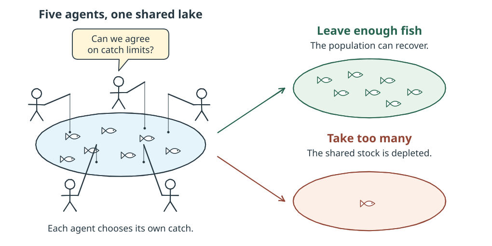

# GovSim

Can a group of AI agents share a resource without exhausting it?

GovSim puts language-model agents in a small society where each agent benefits
from taking a shared resource, but taking too much threatens everyone's future.
In the fishing scenario, for example, agents decide how many fish to catch from
a lake. They can discuss their catches and agree on limits, but each agent still
chooses its own actions.

The experiment comes from [Cooperate or Collapse](https://arxiv.org/abs/2404.16698)
(Piatti et al., NeurIPS 2024). The [GovSim source](https://github.com/giorgiopiatti/GovSim)
contains the original simulation.

## What happens in a run?

Each round represents a month. Agents harvest, observe what others did, discuss
how to manage the resource, and reflect on their experience. The resource can
recover between rounds if enough remains.

The scenarios cover fishing, sheep grazing, and pollution. Variants test what
changes when agents cannot discuss their actions, when a profit-seeking outsider
joins, or when agents are prompted to consider what would happen if everyone
acted as they did. Fishing also has variants with reworded prompts.

## What to look for

Watch whether agents agree on limits, follow those agreements, and leave enough
resource for later rounds. Model calls and resource updates appear during the
run; the group conversation is added after the simulation finishes.

**Resource collapse is a simulation outcome, not an execution failure.**
`collapsed = false` means no collapse was recorded during the run. A short run
without collapse does not establish that cooperation would last.

Results describe how long the resource survived, how much agents collected,
how evenly they shared it, and how much remained. Equality alone is not success:
agents who all collect nothing are also equal.

## Choosing settings

Use a real model and the `mxbai` memory embedder to explore model behavior.
`mock/model` gives scripted replies, and `hash` gives artificial memory
similarities; both are for testing the workflow.

A one-round run is a quick demonstration. Set `max_rounds` to `0` to use the
scenario's full length: normally 12 months, or 15 for outsider scenarios.

These runs are not automatically reproductions of the paper's results. In
particular, `mxbai` downloads model weights whose revision is not pinned.
The `over_usage` result measures how often agents request more than their
sustainable share; its calculation uses the current number of harvesters, which
differs from the original simulation's fixed count when an outsider joins.
